## Welcome to my GitHub 👋

### About me
* Dedicated and proficient software engineer
* Certified by  <a href="https://www.42heilbronn.de/en/">42 Heilbronn</a> & continuously training
* Fluent in English & improving my Czech
* Surfer, tennis player & cat mom 
* Curious about: artificial intelligence & web development

> 42 is the first tuition-free computer training. Its education is based on peer-to-peer learning: participatory, no classes, no professors, all this lets the students fully express their creativity thanks to learning based on project completion. 42 Heilbronn is part of the international <a href="https://www.42network.org/">42 network</a>, of which <a href="https://www.42prague.com/">42 Prague</a> is a part.

### My Tech Stack

### Some of my projects

  
The "ft_transcendence" project aims to create a multiplayer Pong platform featuring real-time gameplay, user management with authentication, AI opponents, live chat functionality, and comprehensive user and game statistics dashboards, all ensuring cross-browser compatibility and multilingual support. 
<strong>Skills: Vue.js, Bootstrap, Django, PostgreSQL API, Docker, teamwork</strong> 

[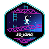](https://github.com/Anoukmch/42_So_long)  
This project involves creating a basic 2D game using the MiniLibX graphical library. The game requires handling textures, sprites, window management, and basic gameplay elements. The player moves using W, A, S, and D keys, with the goal of collecting all items and finding the shortest route to the exit. 
<strong>Skills: C, graphics library, 2D rendering</strong>

  
The aim was to create a robust IRC server, ensuring non-blocking I/O operations with poll(), and implementing essential IRC functionalities such as authentication, nickname management, channel operations (like KICK, INVITE, MODE), and message broadcasting among clients. 
<strong>Skills: C++</strong>  
[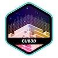](https://github.com/Anoukmch/42_cubed)
[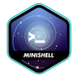](https://github.com/Anoukmch/42_minishell)
[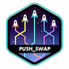](https://github.com/Anoukmch/42_Push_swap)
[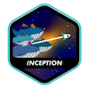](https://github.com/Anoukmch/Inception)

[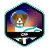](https://github.com/Anoukmch/42_CPP)

[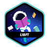](https://github.com/Anoukmch/42-libs)

[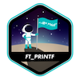](https://github.com/Anoukmch/42-libs)
[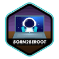](https://github.com/Anoukmch/Anoukmch)
[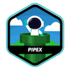](https://github.com/Anoukmch/42_Pipex)
[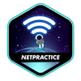](https://github.com/Anoukmch/42-Netpractice)

### Certifications

### Hackathon

### Connect with me!
